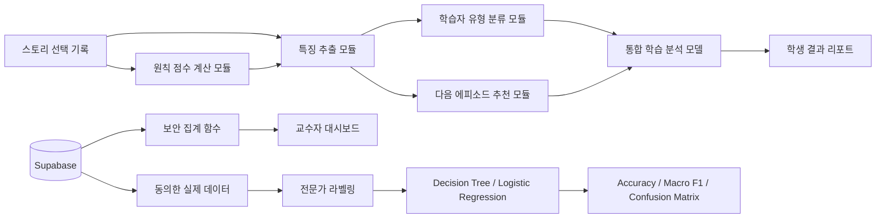

# twAIve 분석 아키텍처

## 실행 구조

## 모듈 책임

| 모듈 | 파일 | 입력 | 출력 |
|---|---|---|---|
| 원칙 점수 계산 | `analysis/principle-scorer.js` | 선택별 0-4 루브릭 | 7대 원칙별 0-100 점수 |
| 특징 추출 | `analysis/feature-extractor.js` | 점수, 판단 이유, 응답 시간, 사전·사후 응답 | 취약 원칙, 위험률, 적극 실천률, 이유 분포, 평균 응답 시간 |
| 학습자 유형 분류 | `analysis/learner-classifier.js` | 특징 벡터 | 학습자 유형, 분류 규칙, 데이터 신뢰도 |
| 콘텐츠 추천 | `analysis/content-recommender.js` | 취약 원칙, 완료 기록 | 다음 에피소드와 실천 행동 |
| 통합 모델 | `analysis/learning-model.js` | 위 네 모듈의 결과 | 학생용 분석 결과와 판단 추적 정보 |
| 호환 어댑터 | `scoring-engine.js` | 기존 앱 호출 | 기존 API를 유지한 모듈 호출 결과 |

## 교수자 대시보드 보안

`get_teacher_dashboard()`는 `teacher_accounts`에 등록된 계정만 호출할 수 있는 `security definer` 함수다. 학생 이름, 아이디, 이메일, 개별 답변은 브라우저로 보내지 않고 다음 집계값만 반환한다.

- 문항별 위험 선택 비율
- 평균 사전·사후 변화
- 원칙별 평균과 취약 순위
- 에피소드별 완료율
- 익명 연구 활용 동의 인원, 동의 기록 수와 학습 준비도

교수자 화면에는 별도의 **시연용 합성 데이터** 전환 기능이 있다. 합성 데이터는 `analysis/demo-analytics.js`가 고정 난수로 브라우저 안에서 생성하며 Supabase, 실제 사용자 통계, 연구 활용 동의 수, 머신러닝 학습 데이터에 저장하거나 합산하지 않는다.

## 통계 모델 전환 조건

운영 중인 모델은 설명 가능한 규칙 기반 모델이다. `ml/train_models.py`는 동의 및 전문가 라벨 데이터가 100건 이상이고 각 클래스가 10건 이상일 때만 Logistic Regression과 Decision Tree를 학습한다. 실제 지표가 생성되기 전에는 정확도나 F1을 화면에 표시하지 않는다.
